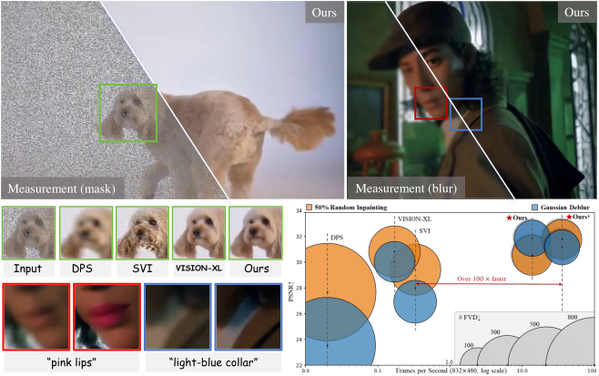

<div align="center">

<h1>⚡ InstantViR</h1>

<h3>Solutor de Problemas Inversos de Video en Tiempo Real con Prior de Difusión Destilado</h3>

<h3>Papel Aceptado en CVPR 2026</h3>

<p>
Weimin Bai<sup>1</sup>, Suzhe Xu<sup>2</sup>, Yiwei Ren<sup>1</sup>, Jinhua Hao<sup>3</sup>, Ming Sun<sup>3</sup>,  
Wenzheng Chen<sup>1</sup>†, He Sun<sup>1</sup>†
</p>

<p>
  <a href="https://ai4scientificimaging.org/instantvir/">
    
  </a>
  <a href="https://arxiv.org/abs/2511.14208">
    
  </a>
  <a href="https://ai4scientificimaging.org/instantvir/#qualitative-results">
    
  </a>
  <a href="#citation">
    
  </a>
</p>



</div>

**InstantViR** es un solucionador amortizado, **causal** de problemas inversos de video aceptado en **CVPR 2026**, destilado a partir de un potente prior de difusión de video, que permite **inpainting** en **streaming**, **deblurring** y **super-resolución 4×** a **velocidad en tiempo real** (por ejemplo, **>35 FPS @ 832×480 en A100**).

> Destilamos un modelo maestro de difusión de video bidireccional en un modelo estudiante autoregresivo causal de **un solo paso**.
> El entrenamiento solo requiere el **prior de difusión congelado** + **operadores de degradación conocidos** (sin datos de video pares limpios/ruidosos).

---

## Puntos destacados

- **Calidad de nivel de difusión a velocidad en tiempo real** para escenarios de streaming (telepresencia, AR/VR, edición interactiva)
- Inferencia amortizada de **un solo paso** destilada de un **prior de difusión de video**
- **DiT autoregresivo causal por bloques** con **KV cache** para inferencia en streaming eficiente
- **LeanVAE** para decodificación latente de alto rendimiento (aceleración adicional de **>2×**)
- Admite **reconstrucción guiada por texto** (opcional) para ediciones controlables

---

## Resultados (Velocidad y Calidad)

A una resolución de **832×480**, InstantViR se ejecuta con **rendimiento en tiempo real** mientras iguala o supera las líneas base basadas en difusión:

- **InstantViR†:** **35.56 FPS** (A100), fuerte consistencia temporal (FVD↓) en todas las tareas  
- Hasta **100× más rápido** que los solucionadores de difusión iterativos (basados en muestreo)

Para comparaciones cualitativas completas y tablas (FVD / PSNR / SSIM / LPIPS), consulte el artículo y la página del proyecto.

---

## Estructura del repositorio / Puntos de entrada

**Entrenamiento**
- Entrenamiento principal de destilación: `instantvir/train_distillation.py`
- Preentrenamiento ODE (opcional): `instantvir/train_ode.py`

**Inferencia**
- Inferencia mínima de problemas inversos: `minimal_inference/autoregressive_inverse_inference.py`

**Conjunto de datos**
- Generación de LMDB pre-degradado: `instantvir/scripts/create_degraded_dataset.py`
- Fusión de fragmentos LMDB: `instantvir/scripts/merge_lmdb_shards.py`

**Configuraciones**
- Directorio de configuraciones: `configs/`
- Ejemplos comunes:
  - WAN inverse inpainting: `configs/wan_causal_inverse_inpainting.yaml`
  - WAN inverse deblur: `configs/wan_causal_inverse_spatial_gaussian.yaml`
  - WAN inverse SR×4: `configs/wan_causal_inverse_sr4.yaml`
  - LeanVAE inverse inpainting: `configs/wan_causal_inverse_inpainting_leanvae.yaml`
  - LeanVAE inverse deblur: `configs/wan_causal_inverse_spatial_gaussian_leanvae.yaml`
  - LeanVAE inverse SR×4: `configs/wan_causal_inverse_sr4_leanvae.yaml`

---

## Configuración del entorno

```bash
conda create -n instantvir python=3.10 -y
conda activate instantvir

pip install torch torchvision
pip install -r requirements.txt
python setup.py develop
```

### Checkpoints

Prepara tus checkpoints según se indica en las configuraciones:

* Directorio de checkpoint base Wan: `wan_models/Wan2.1-T2V-1.3B/`
* Checkpoints de entrenamiento / inferencia:

  * configurados mediante `generator_ckpt` en el YAML, o `--checkpoint_folder` en la CLI
* Si usas **LeanVAE**:

  * `LeanVAE-master/LeanVAE-16ch_ckpt/LeanVAE-dim16.ckpt`

> Consejo: mantén todas las rutas **relativas a la raíz del repositorio** para mayor portabilidad.

---

## Formatos de datos y conceptos clave

### Dos tipos de LMDB

1. **LMDB latente limpio**: solo latentes limpios + prompts
2. **LMDB pre-degradado**: latentes limpios + latentes degradados + prompts (+ máscara opcional)

El entrenamiento/inferencia de problemas inversos suele usar el tipo 2:
`use_predegraded_dataset: true`.

### Mapeo de nombres de tareas

* inpainting: `inverse_problem_type: inpainting`
* deblur (Gaussiano espacial): `inverse_problem_type: spatial_blur`
* SR×4: `inverse_problem_type: super_resolution`

### Indexación de inferencia / Regla de división

`minimal_inference/autoregressive_inverse_inference.py` divide `data_path` en entrenamiento/validación con una relación predeterminada de **9:1** (`seed=42` fijo).
`--test_video_index` se refiere al **índice dentro de la división de validación**.

---
> Los checkpoints y los datos LMDB pre-degradados pueden descargarse desde https://drive.google.com/drive/folders/1TMAIPmuGhwiaR4MtQdnHZwlrAbz3qPNa?usp=sharing
---
## Inferencia rápida (con LMDB pre-degradado existente)

### WAN (inpainting / deblur / SR×4)

```bash
# Inpainting
CUDA_VISIBLE_DEVICES=0 python -m minimal_inference.autoregressive_inverse_inference \
  --config_path configs/wan_causal_inverse_inpainting.yaml \
  --output_folder outputs/infer_inpainting_wan \
  --data_path data/mixkit_latents_inpainting_mask0p5_lmdb \
  --use_predegraded_dataset \
  --checkpoint_folder outputs/wan_causal_inverse_inpainting/<run>/checkpoint_model_<step> \
  --test_video_index 14

# Deblur (Gaussiano espacial)
CUDA_VISIBLE_DEVICES=0 python -m minimal_inference.autoregressive_inverse_inference \
  --config_path configs/wan_causal_inverse_spatial_gaussian.yaml \
  --output_folder outputs/infer_deblur_wan \
  --data_path data/mixkit_latents_spatial_blur_k61_s3_lmdb \
  --use_predegraded_dataset \
  --checkpoint_folder outputs/wan_causal_inverse_spatial_gaussian/<run>/checkpoint_model_<step> \
  --test_video_index 14

# SR×4
CUDA_VISIBLE_DEVICES=0 python -m minimal_inference.autoregressive_inverse_inference \
  --config_path configs/wan_causal_inverse_sr4.yaml \
  --output_folder outputs/infer_sr4_wan \
  --data_path data/sr4_predegraded_merged.lmdb \
  --use_predegraded_dataset \
  --checkpoint_folder outputs/wan_causal_inverse_sr4/<run>/checkpoint_model_<step> \
  --test_video_index 14
```

### LeanVAE (inpainting / deblur / SR×4)

```bash
# Inpainting
CUDA_VISIBLE_DEVICES=0 python -m minimal_inference.autoregressive_inverse_inference \
  --config_path configs/wan_causal_inverse_inpainting_leanvae.yaml \
  --output_folder outputs/infer_inpainting_leanvae \
  --data_path data/inpainting_leanvae_merged.lmdb \
  --use_predegraded_dataset \
  --checkpoint_folder outputs/wan_causal_inverse_inpainting_leanvae_from_wan_ckpt/<run>/checkpoint_model_<step> \
  --test_video_index 14

# Deblur
CUDA_VISIBLE_DEVICES=0 python -m minimal_inference.autoregressive_inverse_inference \
  --config_path configs/wan_causal_inverse_spatial_gaussian_leanvae.yaml \
  --output_folder outputs/infer_deblur_leanvae \
  --data_path data/spatial_gaussian_leanvae_merged.lmdb \
  --use_predegraded_dataset \
  --checkpoint_folder outputs/wan_causal_inverse_spatial_gaussian_leanvae/<run>/checkpoint_model_<step> \
  --test_video_index 14

# SR×4
CUDA_VISIBLE_DEVICES=0 python -m minimal_inference.autoregressive_inverse_inference \
  --config_path configs/wan_causal_inverse_sr4_leanvae.yaml \
  --output_folder outputs/infer_sr4_leanvae \
  --data_path data/sr4_leanvae_merged.lmdb \
  --use_predegraded_dataset \
  --checkpoint_folder outputs/wan_causal_inverse_sr4_leanvae/<run>/checkpoint_model_<step> \
  --test_video_index 14
```

### Salidas

Las salidas de la inferencia incluyen:

* `reconstructed_val_XXX.mp4`
* `original_val_XXX.mp4`
* `degraded_val_XXX_upx4.mp4` / `degraded_val_XXX_lr.mp4`

---

## Reproducción del entrenamiento (InstantViR inverse)

### Entrenamiento Multi-GPU en un solo nodo (Recomendado)

```bash
torchrun --nproc_per_node=4 -m instantvir.train_distillation \
  --config_path configs/wan_causal_inverse_inpainting.yaml \
  --no_visualize
```

Cambia de tarea modificando solo la configuración (y la `data_path` correspondiente), por ejemplo:

* `configs/wan_causal_inverse_spatial_gaussian.yaml`
* `configs/wan_causal_inverse_sr4.yaml`
* `configs/wan_causal_inverse_inpainting_leanvae.yaml`

### Campos requeridos para verificar en las configuraciones

Verifica los siguientes campos en `configs/*.yaml`:

* `data_path`: ruta LMDB para el entrenamiento
* `output_path`: directorio de salida para registros / checkpoints
* `generator_ckpt`: checkpoint de inicialización (o reanudación)
* `inverse_problem_type`: tipo de tarea
* `use_predegraded_dataset`: generalmente `true`
* parámetros específicos de la tarea:

  * inpainting: `mask_ratio`
  * deblur: `blur_kernel_size`, `blur_sigma`, `noise_level`
  * SR×4: `downscale_factor`

### Preentrenamiento ODE (Opcional)

```bash
torchrun --nproc_per_node=4 -m instantvir.train_ode \
  --config_path configs/wan_causal_ode.yaml \
  --no_save
```

---

## Crear LMDB pre-degradado a partir de datos brutos

`instantvir/scripts/create_degraded_dataset.py` admite:

* Leer latentes limpios desde `--original_lmdb_path`
* O leer frames directamente desde `--original_frames_dir`
* Tipos de VAE fuente/destino (`--source_vae_type` + `--vae_type`), incluyendo conversión WAN → LeanVAE

### Ejemplo: SR×4 (único fragmento/shard)

```bash
CUDA_VISIBLE_DEVICES=0 python instantvir/scripts/create_degraded_dataset.py \
  --config_path configs/wan_causal_inverse_sr4.yaml \
  --original_lmdb_path data/mixkit_latents_lmdb \
  --new_lmdb_path data/sr4_predegraded_shard0.lmdb \
  --degradation_type super_resolution \
  --downscale_factor 4 \
  --source_vae_type wan \
  --vae_type wan
```

### Ejemplo: Fuente WAN → Destino LeanVAE (inpainting)

```bash
CUDA_VISIBLE_DEVICES=0 python instantvir/scripts/create_degraded_dataset.py \
  --config_path configs/wan_causal_inverse_inpainting_leanvae.yaml \
  --original_lmdb_path data/mixkit_latents_lmdb \
  --new_lmdb_path data/inpainting_leanvae_shard0.lmdb \
  --degradation_type inpainting \
  --mask_ratio 0.5 \
  --source_vae_type wan \
  --vae_type leanvae \
  --leanvae_ckpt_path LeanVAE-master/LeanVAE-16ch_ckpt/LeanVAE-dim16.ckpt
```

### Fusionar múltiples fragmentos (shards)

```bash
python instantvir/scripts/merge_lmdb_shards.py \
  --shards_glob "data/inpainting_leanvae_shard*.lmdb" \
  --out_lmdb data/inpainting_leanvae_merged.lmdb
```

---

## Solución de problemas

1. `ModuleNotFoundError: No module named 'instantvir'`
   Ejecuta los comandos desde la raíz del repositorio y ejecuta `python setup.py develop`. Si es necesario:

```bash
export PYTHONPATH=$(pwd):$PYTHONPATH
```

2. La inferencia utiliza el conjunto de datos incorrecto
   `--data_path` en la CLI anula `data_path` en la configuración. Diferentes tareas usan diferentes LMDBs pre-degradados por diseño.

3. La memoria de la GPU no se libera después de una interrupción
   Verifica los procesos de Python residuales; reinicia solo después de que todos los procesos relacionados hayan terminado.

4. Incompatibilidad de resolución en SR×4
   Mantén coherentes las resoluciones de entrenamiento e inferencia. El script de inferencia puede ampliar la entrada de SR y reiniciar la caché según el tamaño de `clean_latent`.

---

## Citación

```bibtex
@inproceedings{bai2026instantvir,
  title   = {InstantViR: Real-Time Video Inverse Problem Solver with Distilled Diffusion Prior},
  author  = {Bai, Weimin and Xu, Suzhe and Ren, Yiwei and Hao, Jinhua and
             Sun, Ming and Chen, Wenzheng and Sun, He},
  booktitle = {Proceedings of the IEEE/CVF Conference on Computer Vision and Pattern Recognition (CVPR)},
  year    = {2026}
}
```
