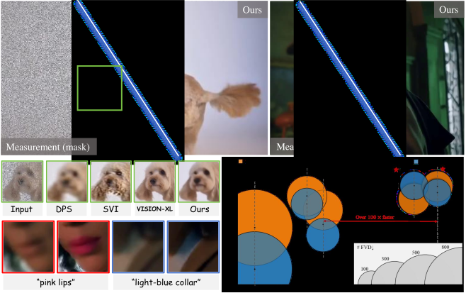

<div align="center">

<h1>⚡ InstantViR</h1>

<h3>Real-Time Video Inverse Problem Solver with Distilled Diffusion Prior</h3>

<h3>CVPR 2026 Accepted Paper</h3>

<p>
Weimin Bai<sup>1</sup>, Suzhe Xu<sup>2</sup>, Yiwei Ren<sup>1</sup>, Jinhua Hao<sup>3</sup>, Ming Sun<sup>3</sup>,  
Wenzheng Chen<sup>1</sup>†, He Sun<sup>1</sup>†
</p>

<p>
  <a href="https://ai4scientificimaging.org/instantvir/">
    
  </a>
  <a href="https://arxiv.org/abs/2511.14208">
    
  </a>
  <a href="https://ai4scientificimaging.org/instantvir/#qualitative-results">
    
  </a>
  <a href="#citation">
    
  </a>
</p>



</div>

**InstantViR** is a **CVPR 2026 accepted** amortized, **causal** video inverse-problem solver distilled from a powerful video diffusion prior,
enabling **streaming** **inpainting**, **deblurring**, and **4× super-resolution** at **real-time speed** (e.g., **>35 FPS @ 832×480 on A100**).

> We distill a bidirectional video diffusion teacher into a **single-step** causal autoregressive student.
> Training requires only the **frozen diffusion prior** + **known degradation operators** (no paired clean/noisy video data).

---

## Highlights

- **Diffusion-level quality at real-time speed** for streaming scenarios (telepresence, AR/VR, interactive editing)
- **One-step** amortized inference distilled from a **video diffusion prior**
- **Causal, block-wise autoregressive DiT** with **KV cache** for efficient streaming inference
- **LeanVAE** for high-throughput latent decoding (**>2×** additional speedup)
- Supports **text-guided reconstruction** (optional) for controllable edits

---

## Results (Speed & Quality)

At **832×480**, InstantViR runs at **real-time throughput** while matching/surpassing diffusion-based baselines:

- **InstantViR†:** **35.56 FPS** (A100), strong temporal consistency (FVD↓) across tasks  
- Up to **100× speedup** over iterative diffusion solvers (sampling-based)

For full qualitative comparisons and tables (FVD / PSNR / SSIM / LPIPS), please refer to the paper and project page.

---

## Repository Structure / Entry Points

**Training**
- Main distillation training: `instantvir/train_distillation.py`
- ODE pretraining (optional): `instantvir/train_ode.py`

**Inference**
- Minimal inverse-problem inference: `minimal_inference/autoregressive_inverse_inference.py`

**Dataset**
- Pre-degraded LMDB generation: `instantvir/scripts/create_degraded_dataset.py`
- LMDB shard merge: `instantvir/scripts/merge_lmdb_shards.py`

**Configs**
- Config directory: `configs/`
- Common examples:
  - WAN inverse inpainting: `configs/wan_causal_inverse_inpainting.yaml`
  - WAN inverse deblur: `configs/wan_causal_inverse_spatial_gaussian.yaml`
  - WAN inverse SR×4: `configs/wan_causal_inverse_sr4.yaml`
  - LeanVAE inverse inpainting: `configs/wan_causal_inverse_inpainting_leanvae.yaml`
  - LeanVAE inverse deblur: `configs/wan_causal_inverse_spatial_gaussian_leanvae.yaml`
  - LeanVAE inverse SR×4: `configs/wan_causal_inverse_sr4_leanvae.yaml`

---

## Environment Setup

```bash
conda create -n instantvir python=3.10 -y
conda activate instantvir

pip install torch torchvision
pip install -r requirements.txt
python setup.py develop
````

### Checkpoints

Prepare your checkpoints as specified in configs:

* Wan base checkpoint dir: `wan_models/Wan2.1-T2V-1.3B/`
* Training / inference checkpoints:

  * set via `generator_ckpt` in YAML, or `--checkpoint_folder` in CLI
* If using **LeanVAE**:

  * `LeanVAE-master/LeanVAE-16ch_ckpt/LeanVAE-dim16.ckpt`

> Tip: keep all paths **relative to repo root** for portability.

---

## Data Formats and Key Concepts

### Two LMDB Types

1. **clean latent LMDB**: clean latents + prompts only
2. **predegraded LMDB**: clean latents + degraded latents + prompts (+ optional mask)

Inverse-problem training/inference typically uses type 2:
`use_predegraded_dataset: true`.

### Task Name Mapping

* inpainting: `inverse_problem_type: inpainting`
* deblur (spatial Gaussian): `inverse_problem_type: spatial_blur`
* SR×4: `inverse_problem_type: super_resolution`

### Inference Indexing / Split Rule

`minimal_inference/autoregressive_inverse_inference.py` splits `data_path` into train/val with default **9:1** ratio (fixed `seed=42`).
`--test_video_index` refers to the **index in the val split**.

---
> Checkpoints and predegraded LMDB data can be downloaded from https://drive.google.com/drive/folders/1TMAIPmuGhwiaR4MtQdnHZwlrAbz3qPNa?usp=sharing
---
## Quick Inference (with Existing predegraded LMDB)

### WAN (inpainting / deblur / SR×4)

```bash
# Inpainting
CUDA_VISIBLE_DEVICES=0 python -m minimal_inference.autoregressive_inverse_inference \
  --config_path configs/wan_causal_inverse_inpainting.yaml \
  --output_folder outputs/infer_inpainting_wan \
  --data_path data/mixkit_latents_inpainting_mask0p5_lmdb \
  --use_predegraded_dataset \
  --checkpoint_folder outputs/wan_causal_inverse_inpainting/<run>/checkpoint_model_<step> \
  --test_video_index 14

# Deblur (spatial Gaussian)
CUDA_VISIBLE_DEVICES=0 python -m minimal_inference.autoregressive_inverse_inference \
  --config_path configs/wan_causal_inverse_spatial_gaussian.yaml \
  --output_folder outputs/infer_deblur_wan \
  --data_path data/mixkit_latents_spatial_blur_k61_s3_lmdb \
  --use_predegraded_dataset \
  --checkpoint_folder outputs/wan_causal_inverse_spatial_gaussian/<run>/checkpoint_model_<step> \
  --test_video_index 14

# SR×4
CUDA_VISIBLE_DEVICES=0 python -m minimal_inference.autoregressive_inverse_inference \
  --config_path configs/wan_causal_inverse_sr4.yaml \
  --output_folder outputs/infer_sr4_wan \
  --data_path data/sr4_predegraded_merged.lmdb \
  --use_predegraded_dataset \
  --checkpoint_folder outputs/wan_causal_inverse_sr4/<run>/checkpoint_model_<step> \
  --test_video_index 14
```

### LeanVAE (inpainting / deblur / SR×4)

```bash
# Inpainting
CUDA_VISIBLE_DEVICES=0 python -m minimal_inference.autoregressive_inverse_inference \
  --config_path configs/wan_causal_inverse_inpainting_leanvae.yaml \
  --output_folder outputs/infer_inpainting_leanvae \
  --data_path data/inpainting_leanvae_merged.lmdb \
  --use_predegraded_dataset \
  --checkpoint_folder outputs/wan_causal_inverse_inpainting_leanvae_from_wan_ckpt/<run>/checkpoint_model_<step> \
  --test_video_index 14

# Deblur
CUDA_VISIBLE_DEVICES=0 python -m minimal_inference.autoregressive_inverse_inference \
  --config_path configs/wan_causal_inverse_spatial_gaussian_leanvae.yaml \
  --output_folder outputs/infer_deblur_leanvae \
  --data_path data/spatial_gaussian_leanvae_merged.lmdb \
  --use_predegraded_dataset \
  --checkpoint_folder outputs/wan_causal_inverse_spatial_gaussian_leanvae/<run>/checkpoint_model_<step> \
  --test_video_index 14

# SR×4
CUDA_VISIBLE_DEVICES=0 python -m minimal_inference.autoregressive_inverse_inference \
  --config_path configs/wan_causal_inverse_sr4_leanvae.yaml \
  --output_folder outputs/infer_sr4_leanvae \
  --data_path data/sr4_leanvae_merged.lmdb \
  --use_predegraded_dataset \
  --checkpoint_folder outputs/wan_causal_inverse_sr4_leanvae/<run>/checkpoint_model_<step> \
  --test_video_index 14
```

### Outputs

Inference outputs include:

* `reconstructed_val_XXX.mp4`
* `original_val_XXX.mp4`
* `degraded_val_XXX_upx4.mp4` / `degraded_val_XXX_lr.mp4`

---

## Training Reproduction (InstantViR inverse)

### Single-Node Multi-GPU Training (Recommended)

```bash
torchrun --nproc_per_node=4 -m instantvir.train_distillation \
  --config_path configs/wan_causal_inverse_inpainting.yaml \
  --no_visualize
```

Switch tasks by changing config only (and corresponding `data_path`), e.g.:

* `configs/wan_causal_inverse_spatial_gaussian.yaml`
* `configs/wan_causal_inverse_sr4.yaml`
* `configs/wan_causal_inverse_inpainting_leanvae.yaml`

### Required Fields to Verify in Configs

Please check the following fields in `configs/*.yaml`:

* `data_path`: LMDB path for training
* `output_path`: output directory for logs / checkpoints
* `generator_ckpt`: initialization checkpoint (or resume)
* `inverse_problem_type`: task type
* `use_predegraded_dataset`: usually `true`
* task-specific parameters:

  * inpainting: `mask_ratio`
  * deblur: `blur_kernel_size`, `blur_sigma`, `noise_level`
  * SR×4: `downscale_factor`

### ODE Pretraining (Optional)

```bash
torchrun --nproc_per_node=4 -m instantvir.train_ode \
  --config_path configs/wan_causal_ode.yaml \
  --no_save
```

---

## Build predegraded LMDB from Raw Data

`instantvir/scripts/create_degraded_dataset.py` supports:

* Reading clean latents from `--original_lmdb_path`
* Or reading frames directly from `--original_frames_dir`
* Source/target VAE types (`--source_vae_type` + `--vae_type`), including WAN → LeanVAE conversion

### Example: SR×4 (single shard)

```bash
CUDA_VISIBLE_DEVICES=0 python instantvir/scripts/create_degraded_dataset.py \
  --config_path configs/wan_causal_inverse_sr4.yaml \
  --original_lmdb_path data/mixkit_latents_lmdb \
  --new_lmdb_path data/sr4_predegraded_shard0.lmdb \
  --degradation_type super_resolution \
  --downscale_factor 4 \
  --source_vae_type wan \
  --vae_type wan
```

### Example: WAN Source → LeanVAE Target (inpainting)

```bash
CUDA_VISIBLE_DEVICES=0 python instantvir/scripts/create_degraded_dataset.py \
  --config_path configs/wan_causal_inverse_inpainting_leanvae.yaml \
  --original_lmdb_path data/mixkit_latents_lmdb \
  --new_lmdb_path data/inpainting_leanvae_shard0.lmdb \
  --degradation_type inpainting \
  --mask_ratio 0.5 \
  --source_vae_type wan \
  --vae_type leanvae \
  --leanvae_ckpt_path LeanVAE-master/LeanVAE-16ch_ckpt/LeanVAE-dim16.ckpt
```

### Merge Multiple Shards

```bash
python instantvir/scripts/merge_lmdb_shards.py \
  --shards_glob "data/inpainting_leanvae_shard*.lmdb" \
  --out_lmdb data/inpainting_leanvae_merged.lmdb
```

---

## Troubleshooting

1. `ModuleNotFoundError: No module named 'instantvir'`
   Run commands from repo root and execute `python setup.py develop`. If needed:

```bash
export PYTHONPATH=$(pwd):$PYTHONPATH
```

2. Inference uses the wrong dataset
   CLI `--data_path` overrides `data_path` in config. Different tasks use different predegraded LMDBs by design.

3. GPU memory not released after interruption
   Check leftover Python processes; restart only after all related processes have exited.

4. SR×4 resolution mismatch
   Keep train/inference resolutions consistent. The inference script may upsample SR input and reset cache based on `clean_latent` size.

---

## Citation

```bibtex
@inproceedings{bai2026instantvir,
  title   = {InstantViR: Real-Time Video Inverse Problem Solver with Distilled Diffusion Prior},
  author  = {Bai, Weimin and Xu, Suzhe and Ren, Yiwei and Hao, Jinhua and
             Sun, Ming and Chen, Wenzheng and Sun, He},
  booktitle = {Proceedings of the IEEE/CVF Conference on Computer Vision and Pattern Recognition (CVPR)},
  year    = {2026}
}
```
